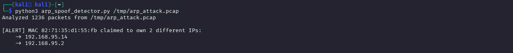
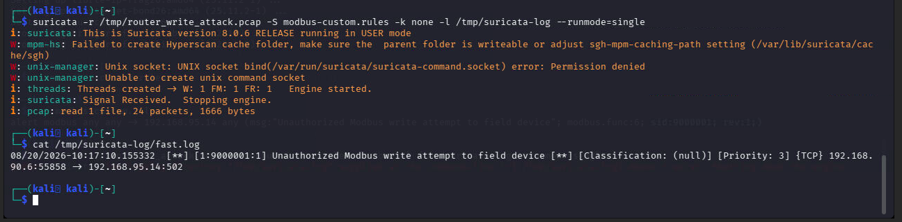
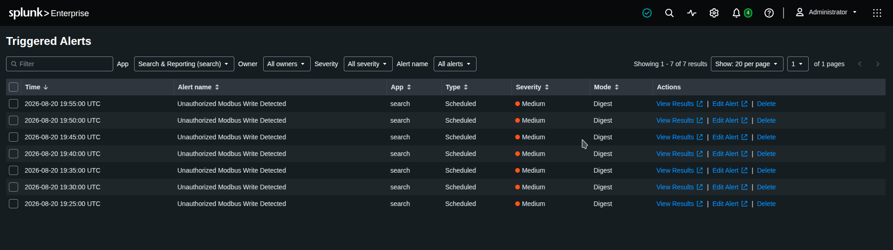
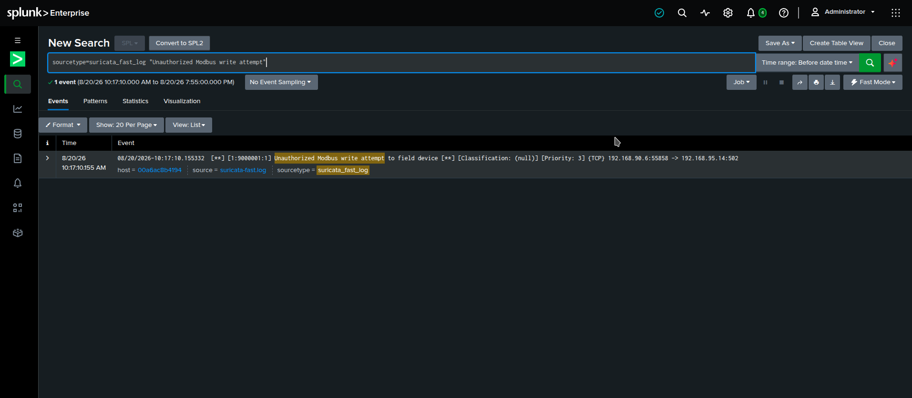
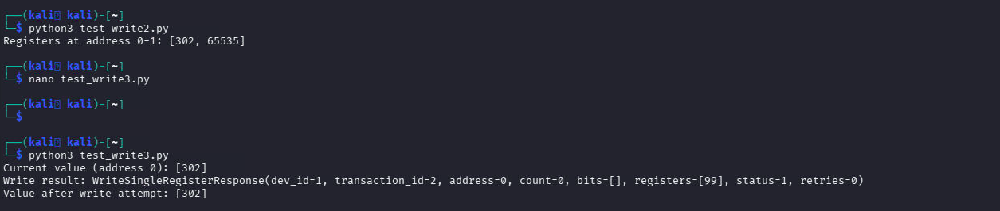
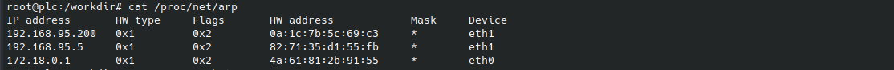

# ICS Modbus Attack Testing — Probing Input Register Protections and ARP Spoofing on a Simulated PLC

## Objective
Test, rather than assume, whether two common attack techniques against 
industrial control traffic actually work in practice: (1) directly writing 
a fabricated value into a live sensor reading, and (2) intercepting 
PLC-to-device traffic via ARP spoofing. This project demonstrates hands-on 
attack testing against a simulated OT environment, building on the 
segmentation design from my [Purdue Model Mapping project](https://github.com/carmelin-neto/ot-purdue-model-mapping/blob/main/screenshots/purdue-model-oilgas..drawio.png) 
and the theoretical risks covered in my [Scanning Risk Writeup](https://github.com/carmelin-neto/ot-active-scanning-risk).
The Suricata rule and Splunk alert built here are the detection stack referenced throughout my [ot-incident-response-scenario](https://github.com/carmelin-neto/ot-incident-response-scenario)
The Modbus exposure demonstrated here is scored formally in [ot-risk-assessment](https://github.com/carmelin-neto/ot-risk-assessment) and confirmed independently in [ot-vulnerability-assessment](https://github.com/carmelin-neto/ot-vulnerability-assessment).
The write attack demonstrated here is blocked a second, independent way in [ot-access-control-design](https://github.com/carmelin-neto/ot-access-control-design) — via role permissions rather than network controls.

## Why This Project
It's one thing to explain why OT attacks are risky in theory — it's another 
to actually test whether a specific technique works against a real (if 
simulated) PLC, and to understand exactly why it succeeds or fails at the 
protocol level. This project shows I can move from concept to hands-on 
verification, and that I understand Modbus deeply enough to interpret 
results that weren't the ones I initially expected.

## Environment / Tools
- GRFICS v3 (Fortiphyd) — Docker-based industrial control system simulation
- Wireshark / tshark — packet capture and protocol analysis
- Python + pymodbus — scripted Modbus read/write testing
- arpspoof (dsniff) — ARP cache poisoning attempt
- Network segmentation: DMZ subnet (192.168.90.x) and ICS subnet 
  (192.168.95.x), consistent with the Purdue Model boundary from Project 1

## Detection Engineering Addition

To go beyond attack testing, I wrote a small Python detection script 
(`detection/arp_spoof_detector.py`, using Scapy) that flags the exact 
signature of the ARP spoofing attack I ran above: a single MAC address 
claiming ownership of more than one IP address in a capture window.

I validated it two ways:

1. **Against the attack traffic** — the script correctly flagged the MAC 
   address used in the spoofing attempt, showing it had claimed to own 
   both the PLC's IP and the target device's IP simultaneously:

   

2. **Against clean, legitimate traffic** (my original PLC capture with no 
   attack activity) — the script correctly reported no spoofing signature, 
   confirming it doesn't false-positive on normal network behavior:

   

This closes the loop between offense and defense: I didn't just run an 
attack and observe the result — I built and validated a way to detect it.

## IDS Detection with Suricata

To complement the custom ARP detection script, I built and tested a 
Suricata rule targeting the Modbus write attack specifically:
This uses Suricata's native Modbus protocol parser — not a port-based 
guess — to match the exact function code (6, Write Single Register) used 
in my earlier write-attack test, targeting the specific field device.

**Getting a working capture for this took real troubleshooting**: my first 
attempts captured on the wrong network segment (the PLC container isn't 
actually in the traffic path between the attacker and this specific 
device — the router is). Once I captured on the router's ICS-facing 
interface instead, the traffic — and the alert — showed up correctly.

Validated two ways:

1. **Against the write-attack traffic** — Suricata correctly fired:
   

2. **Against 67,457 packets of legitimate read-only traffic** — zero 
   alerts, confirming the rule doesn't false-positive on normal operation:
   

   ## SIEM & Alerting with Splunk

To complete the detection pipeline, I brought the Suricata alert data into 
Splunk and configured it as a real, scheduled alert — not just a saved 
search.

**Search:**
I initially scheduled this to run every 5 minutes to validate the full 
pipeline quickly, confirmed it fired correctly and repeatedly on real data, 
then relaxed the schedule back to a production-appropriate interval.

**One licensing detail worth noting**: Splunk's Enterprise Trial license 
runs 60 days, after which it converts to a Free license that disables 
scheduled alerting entirely (search and dashboards still work). I built 
and validated this alert early in the trial window specifically to make 
sure the working functionality was demonstrated and documented before that 
constraint applied.

**Evidence:**

## What I Did
1. Captured live Modbus traffic directly from the PLC container to identify 
   which of six field devices carried an actively-changing sensor value 
   (as opposed to static/idle registers).
2. Wrote a Python script using pymodbus to read the live sensor value, 
   attempt to overwrite it with a fabricated value, then read it again to 
   check whether the write took effect.
3. Set up a two-directional ARP spoofing attack from a device positioned on 
   the same network segment as the PLC, attempting to insert myself into 
   the traffic path between the PLC and the target sensor device.
4. Verified the spoofing attempt's actual effect by directly inspecting the 
   PLC's ARP cache, rather than assuming success from the tool running 
   without errors.
5. Built and validated a Suricata IDS rule targeting the exact Modbus 
   write attack tested above (unit 1, function 6). Discovered mid-build 
   that traffic between the attacker and the target device doesn't pass 
   through the PLC — it routes through the router — and adjusted the 
   capture point accordingly. Confirmed the rule fires on the write-attack 
   traffic and stays silent on 67,457 packets of legitimate read-only 
   traffic.
6. Ingested the Suricata alert data into Splunk Enterprise (Docker) and 
   built a scheduled correlation search matching the exact alert signature. 
   Configured it as a real alert, tested it firing repeatedly on a tight 
   schedule to confirm the whole pipeline (search → trigger → triggered 
   alert) worked end-to-end, then relaxed the schedule back to a sensible 
   production cadence once validated.

## Findings

I tested whether the live tank-level sensor value could be directly 
overwritten by sending a write command of `99` to the register. The write 
technically succeeded and returned a success status, but the actual sensor 
reading stubbornly remained at `302`, unaffected. This happens because 
Modbus separates "Input Registers" (the read-only space where the sensor 
value actually lives) from "Holding Registers" (the space a write command 
targets), even when both use the same numeric address. The write landed in 
a completely different memory zone than the one the sensor was actually 
reading from — confirming that the protocol-level separation genuinely 
holds, not just in theory.

I also attempted an ARP spoofing man-in-the-middle attack from a device 
positioned on the same network segment as the PLC, sending forged ARP 
replies to both the PLC and the target sensor device to try to intercept 
their traffic. The spoofing process ran continuously with no errors on my 
end, but checking the PLC's actual ARP table afterward showed no entry for 
the target device at all — not a poisoned one, just none. This failed 
because the PLC's underlying Linux system ignores unsolicited "gratuitous" 
ARP announcements by default, and only updates its ARP cache in response to 
a request it explicitly sent out itself.

## What I'd Do Differently in Production
Both results here are specific to this simulated environment's default 
configuration. A real assessment would need to test whether the target's 
ARP handling can be forced into accepting spoofed entries (e.g., by timing 
replies against genuine ARP requests rather than sending gratuitous ones), 
and would need to map which specific Modbus function codes and register 
types are writable on the actual devices in scope, rather than assuming 
uniform behavior across a fleet of PLCs.

The Suricata rule built here is also narrowly scoped — it detects writes 
to one specific device and function code, not a general ruleset. Production 
deployment would need coverage across every field device and function code 
that shouldn't be writable, plus source-based filtering (e.g., alerting 
only on writes originating outside the known engineering workstation 
range) rather than function-code matching alone.

This alert is built on a single static log file uploaded once — a 
production deployment would use a live forwarder (Splunk Universal 
Forwarder or HEC) to stream Suricata's fast.log continuously, and the 
correlation search would need to cover the full ruleset, not one signature.

## Screenshots

